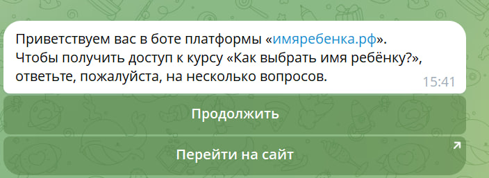
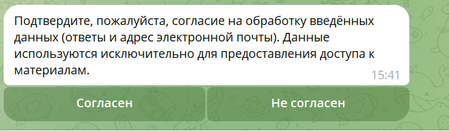
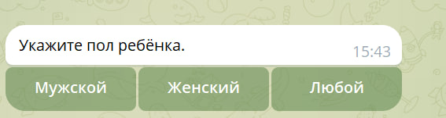
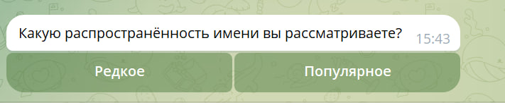
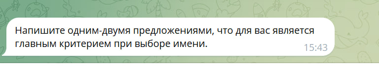
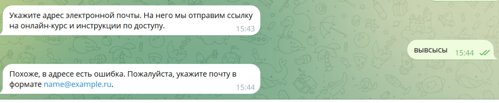
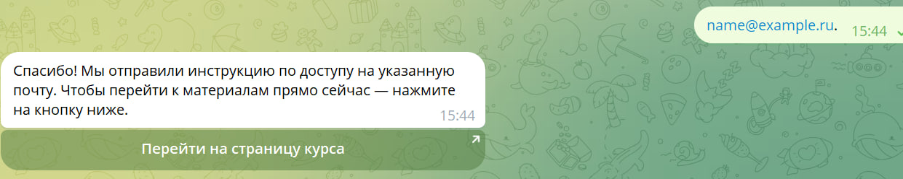
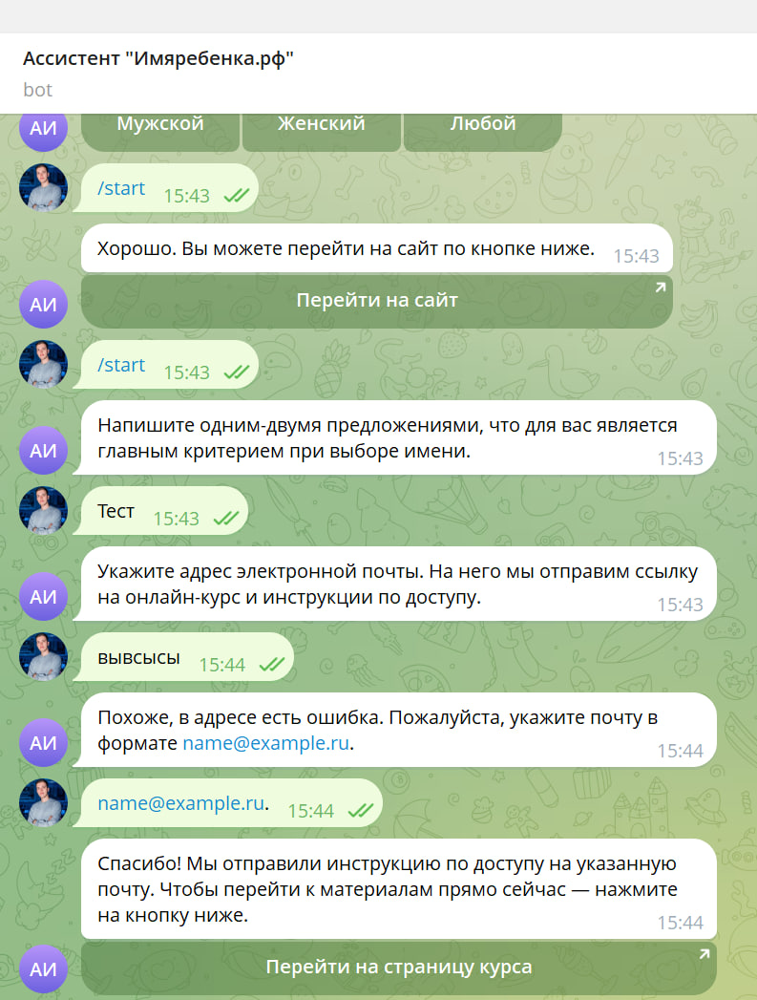
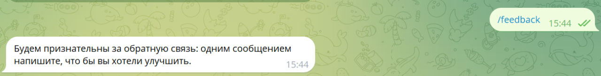

University: [ITMO University](https://itmo.ru/ru/)
Faculty: [FICT](https://fict.itmo.ru)
Course: [Vibe Coding: AI-боты для бизнеса](https://github.com/itmo-ict-faculty/vibe-coding-for-business)
Year: 2025/2026
Group: U4225
Author: Nokhrin Valeriy Vitalyevich
Lab: Lab1
Date of create: 24.10.2025
Date of finished: —

---

### Описание задачи
В рамках первой лабораторной работы я разработал Telegram-бота, который задаёт несколько вопросов, запрашивает электронную почту и выдаёт ссылку на онлайн-курс по выбору имени ребёнку. Цель — реализовать рабочий диалоговый сценарий, сохранить ответы и подготовить основу для развития в следующих работах.

### Какую проблему решает бот
Я разрабатываю онлайн-сервис по выбору имени для ребёнка и хочу собирать лиды через лид магнит (онлайн курс). Бот решает реальную бизнес задачу: он вовлекает пользователя короткой последовательностью шагов, а затем собирает e-mail. Такой формат повышает конверсию, потому что коммуникация в чат-формате ощущается проще, чем форма на сайте.

### Почему выбрана именно эта задача
Мне нужен удобный и короткий канал, который собирает контакты и не перегружает пользователя. Telegram подходит для этого, так как диалог воспринимается естественно и не вызывает отторжения. Кроме того, бот легко масштабируется: в следующих лабораторных его можно расширить до полноценной воронки.

### Промпт для LLM
LLM использовалась только на этапе разработки сценария и структуры сообщений.

**Исходный промпт:**  
«Составь воронку для Telegram-бота, которая задаёт несколько вопросов и мотивирует пользователя оставить e-mail ради получения курса по выбору имени.»

**Итерации:**  
Я сократил количество открытых вопросов, оставил только один и сформулировал сообщения короче, чтобы работа бота ощущалась быстрее и проще.

**Финальный промпт:**  
«Сформулируй диалоговый сценарий Telegram-бота для сбора контактных данных. Сообщения должны быть короткими и понятными, с минимальным количеством шагов до ввода e-mail.»

### Стек технологий
Использованы Python и библиотеки python-telegram-bot и python-dotenv. Я выбрал их из-за простоты реализации сценариев, работы с кнопками и диалоговыми состояниями. Для хранения данных использовал JSONL, так как в рамках первой лабораторной это самый быстрый вариант без лишней инфраструктуры.

### Скриншоты
Файлы находятся в директории `lab1/media/`:

### Видео
Демонстрация работы бота  
https://drive.google.com/file/d/1OfkZfBNhTA-KbnDXOGZuMt_skt-f0Srn/view?usp=drive_link

### Трудности и решения
1. Логика состояния. Чтобы бот не путал свободный ввод и ответы по кнопкам, я чётко разделил шаги на состояния.  
2. Валидация e-mail. Первая версия допускала некорректные адреса, в финальной я упростил и ужесточил проверку.  
3. Избыточные вопросы. Я сократил сценарий до минимально необходимого, чтобы повысить завершение диалога.

### Выводы
Мне удалось разработать полностью рабочий Telegram-бот с небольшим сценарием и сбором данных. Я разобрался в структуре диалогов, обработке сообщений и валидации.
