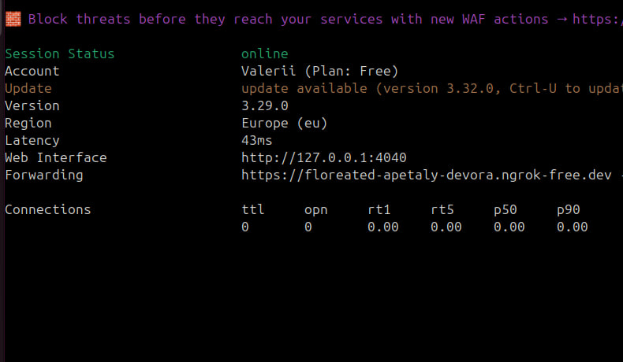
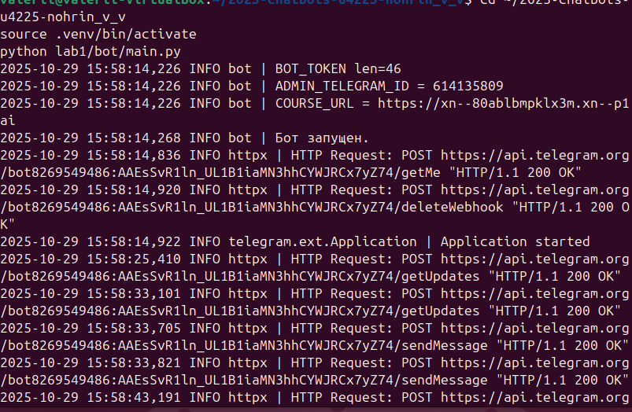
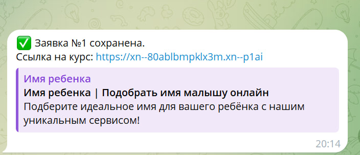
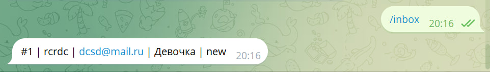
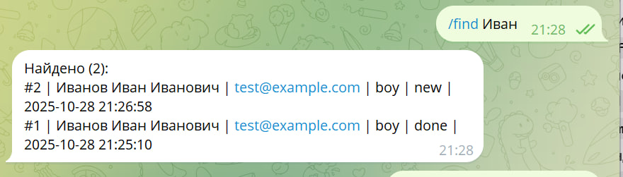
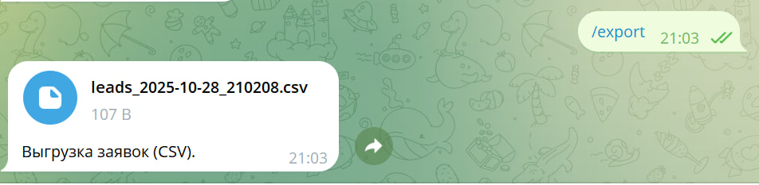
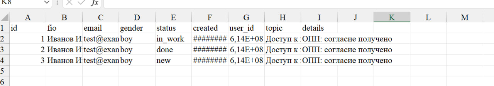
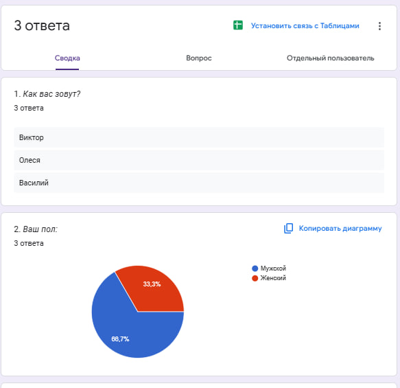
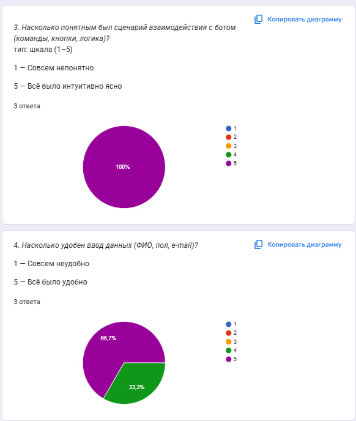
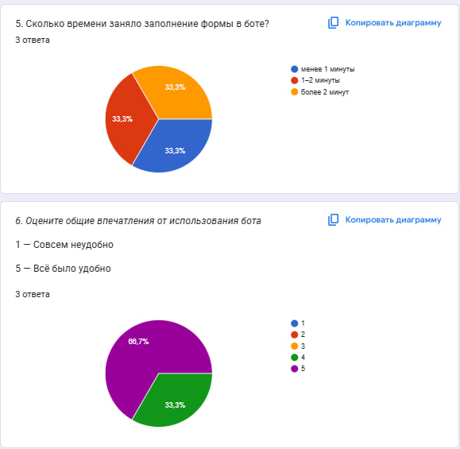

# Лабораторная работа №3
University: ITMO University
Faculty: FICT
Course: Vibe Coding: AI-боты для бизнеса
Year: 2025
Group: U4225
Author: Nokhrin Valeriy Vitalievich
Lab: Lab3
Date of create: 29.10.2025
Date of finished: 

---
**Бот:** [@itmoftmi_nvv_bot](https://t.me/itmoftmi_nvv_bot)  
**Форма для отзывов:** [Google Forms](https://docs.google.com/forms/d/e/1FAIpQLScv9MhGZZdhqT0N0TtjzJOzR23BYInjbX4FfiGCcfdxcyWvgw/viewform?usp=dialog)

## 1. Цель работы
Закрепить навыки работы с Telegram Bot API и научиться подключать webhook с использованием ngrok.  
Реализовать рабочий бот, который принимает данные от пользователя, сохраняет их в файл и предоставляет администратору инструменты для просмотра и выгрузки заявок.

---

## 2. Ход выполнения работы

### 2.1. Настройка окружения
Для запуска бота был выбран **локальный деплой через ngrok**, так как он позволяет быстро организовать временный публичный URL для тестирования webhook.  
Создан виртуальный окружение Python, установлены зависимости из `requirements.txt`, добавлены переменные в файл `.env`:

BOT_TOKEN
ADMIN_TELEGRAM_ID
COURSE_URL=https://xn--80ablbmpklx3m.xn--p1ai
DATA_DIR=lab2/data

После этого выполнен запуск двумя параллельными окнами:  
- `python lab1/bot/main.py` — бот,  
- `ngrok http 8000` — туннель.

---

### 2.2. Настройка webhook
Из панели ngrok скопирован адрес вида  
`https://floreated-apetaly-devora.ngrok-free.dev`  
и установлен в Telegram через запрос:
https://api.telegram.org/bot<token>/setWebhook?url=<адрес>/webhook

После выполнения команды проверено — webhook установлен успешно.

---

### 2.3. Тестирование бота
Бот работает по следующему сценарию:  
1. Пользователь нажимает `/start`.  
2. Бот просит согласие на обработку ПДн (кнопки Да/Нет).  
3. При согласии пользователь вводит ФИО, выбирает пол и вводит e-mail.  
4. После заполнения бот сохраняет заявку и высылает финальную ссылку на курс.  

Все данные автоматически сохраняются в `lab2/data/leads.csv`.

---

### 2.4. Проверка админских команд
Для администратора реализованы команды:  

- `/inbox` – список новых заявок,  
- `/find <имя>` – поиск по ФИО или e-mail,  
- `/set_status <ID> <new|in_work|done>` – смена статуса заявки,  
- `/export` – выгрузка CSV-файла.

Команды проверены на реальных данных, все отрабатывают корректно.  
Выгрузка CSV проверена в Excel — данные распределены по столбцам, кодировка UTF-8.

---

### 2.5. Сбор обратной связи
Чтобы оценить удобство бота, создана [Google-форма](https://docs.google.com/forms/d/e/1FAIpQLScv9MhGZZdhqT0N0TtjzJOzR23BYInjbX4FfiGCcfdxcyWvgw/viewform?usp=dialog).  
Тестирование прошли три человека — Виктор, Олеся и Василий.  
Они оценили сценарий на 5/5, удобство ввода на 4.7/5, а общее впечатление на 4.7/5.  

**Комментарии:**  
- «Всё понятно и удобно, бот быстро реагирует.»  
- «Добавить подсказку при вводе почты.»  
- «Красивое оформление, понятные кнопки.»

---

## 3. Результаты
- Бот запускается через ngrok и обрабатывает webhook.  
- Заявки корректно сохраняются в CSV.  
- Все админ-команды функционируют.  
- Получен положительный фидбек от пользователей.  
- Реализованы все требования лабораторной.

---

## 4. Вывод
Лабораторная работа выполнена полностью.  
Удалось закрепить навыки работы с Telegram Bot API, настройкой webhook и обработкой заявок в реальном времени.  
Проект показывает, как можно связать бота, локальный сервер и анализ результатов через Google Forms.  
Бот готов к дальшему развитию — например, автоматической отправке писем или интеграции с БД.

---

## Приложение: скриншоты

  
  
  
  
  
  
  
  
  

